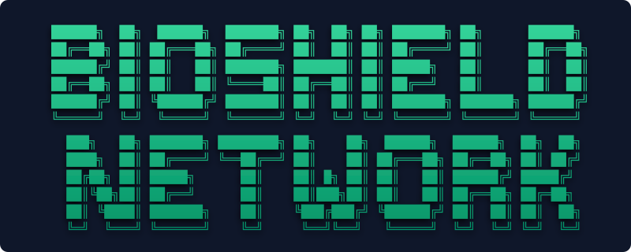

 

*An enterprise-grade, 10-week Blue Team architecture lab demonstrating zero-trust segmentation, cryptographic tunneling, and perimeter defense for the healthcare sector.*

 

> **Project Overview:** BioShield is a simulated healthcare IT provider managing mission-critical Electronic Health Records (EHR), secure telemedicine platforms, and automated disaster recovery services. This repository contains the complete network architecture designed in Cisco Packet Tracer, engineered to meet strict data isolation and compliance requirements.

---

## 🏗️ 10-Week Deployment Lifecycle

This infrastructure was built iteratively over a 10-week project sprint, mirroring a real-world enterprise network rollout:

* **Weeks 1–3 (Planning & Baseline):** Business requirement analysis, security budgeting, threat modeling, and initial baseline topology design.
* **Weeks 4–5 (Segmentation):** Implementation of Layer 2 VLANs, 802.1Q trunking, and Inter-VLAN routing (Router-on-a-Stick).
* **Week 7 (Infrastructure Expansion):** Scaling the topology to accommodate new departments and integrating the DMZ server farm.
* **Week 8 (Perimeter Defense):** Deployment of the Zone-Based Policy Firewall (ZPF) and edge routing.
* **Week 10 (Secure Connectivity):** Finalizing the IPsec Site-to-Site VPN to the remote branch and deploying the WPA2-Enterprise wireless infrastructure.

---

## 🗺️ Network Topology & IP Addressing Scheme

To minimize the blast radius of a potential breach and enforce strict access controls, the internal network utilizes granular subnets. 

| VLAN ID | Department | Subnet Allocation | Default Gateway | Security Context |
| :--- | :--- | :--- | :--- | :--- |
| **VLAN 10** | Management / IT | `192.168.10.0/24` | `192.168.10.1` | Privileged access to network infrastructure (SSH/Telnet). |
| **VLAN 20** | Finance | `192.168.20.0/24` | `192.168.20.1` | Highly restricted; isolated financial transaction data. |
| **VLAN 30** | Operations | `192.168.30.0/24` | `192.168.30.1` | Standard operational traffic. |
| **VLAN 40** | Human Resources | `192.168.40.0/24` | `192.168.40.1` | Contains internal PII and employee records. |
| **VLAN 50** | Customer Support | `192.168.50.0/24` | `192.168.50.1` | External-facing support interactions. |
| **VLAN 60** | Servers / DMZ | `192.168.60.0/24` | `192.168.60.1` | DMZ housing `bioshield.com` Web and Mail services. |

---

## 🛡️ Core Security Engineering

### 1. Zone-Based Policy Firewall (ZPF)
Traditional ACLs are insufficient for stateful enterprise defense. A Zone-Based Firewall was configured on the edge router with the following zones:
* **IN-ZONE:** Trusted internal VLANs (10-50).
* **OUT-ZONE:** Untrusted public internet.
* **DMZ-ZONE:** Semi-trusted server infrastructure (VLAN 60).
* **Policy Logic:** Traffic originating from `IN-ZONE` to `OUT-ZONE` is inspected and permitted. Traffic from `OUT-ZONE` to `IN-ZONE` is strictly denied unless it is returning stateful traffic. `OUT-ZONE` to `DMZ-ZONE` is restricted strictly to HTTPS (443).

### 2. Access Control Lists (ACLs) & Zero-Trust
Extended Access Control Lists were applied at the routing layer to prevent unauthorized lateral movement:
* **Inter-VLAN Restrictions:** Explicit `deny` statements prevent standard departments (e.g., Customer Support) from pinging or accessing the Finance and HR subnets.
* **Protocol Hardening:** HTTP (Port 80) is explicitly dropped. All web traffic to the internal servers is forced over HTTPS (Port 443).

### 3. Cryptographic Remote Access (IPsec VPN)
To securely connect the Remote Branch Office to BioShield HQ over the public internet, a Site-to-Site VPN was established:
* **ISAKMP Phase 1:** Authenticated via Pre-Shared Keys (PSK).
* **IPsec Phase 2:** Traffic encrypted using AES (Advanced Encryption Standard) and hashed via SHA to ensure data-in-transit confidentiality and integrity.
* **Validation:** Verified successfully using `show crypto isakmp sa` and `show crypto ipsec sa`.

### 4. Secure Wireless Deployment (WLAN)
A localized wireless network was integrated directly into the switch infrastructure for mobile employee access:
* **SSID:** `HQ_Wireless`
* **Band:** 2.4 GHz (Mixed Mode)
* **Authentication/Encryption:** WPA2-PSK (AES) using the passphrase `BioShield`.
* **Validation:** Client laptops successfully authenticated via AES encryption with verified traffic flow to the internal domain.

---

## 🖥️ Server & Application Infrastructure

The DMZ (VLAN 60) houses the critical application servers, resolving internally via a centralized DNS architecture:
* **Domain Name:** `bioshield.com`
* **Web Services:** Secure HTTPS portal for internal EHR access.
* **Mail Services:** Cross-VLAN SMTP/POP3 email gateway, enabling secure inter-departmental communication without relying on external third-party mail providers.

---

## 📂 Repository Contents

* `ProjectCSCI368_final.pkt`: The complete, runnable Cisco Packet Tracer topology file. *(Requires Packet Tracer 8.x+)*
* `Network Security - Bioshield.pdf`: The finalized executive presentation detailing the architecture, configurations, and verification results.
* `CSCI368 Week 10 Bioshield.docx`: The comprehensive 10-week engineering log, budget justifications, risk assessments, and technical report.

---
*Disclaimer: This topology and architecture represent a simulated environment created for academic security research, threat modeling, and portfolio demonstration purposes.*
